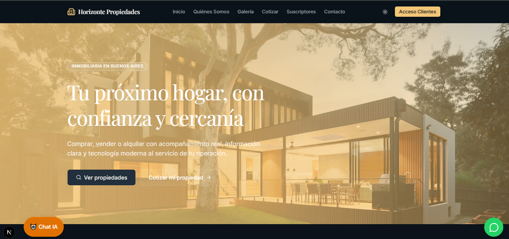
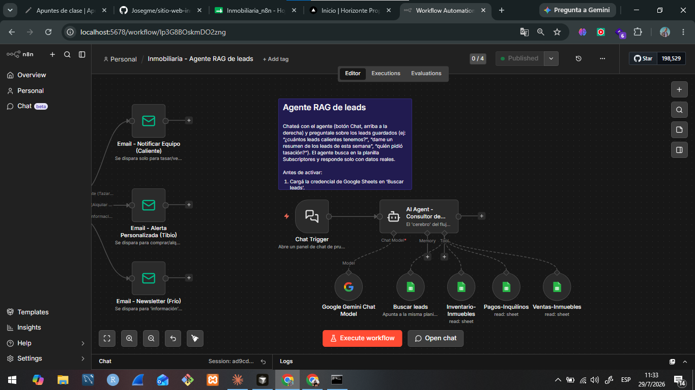
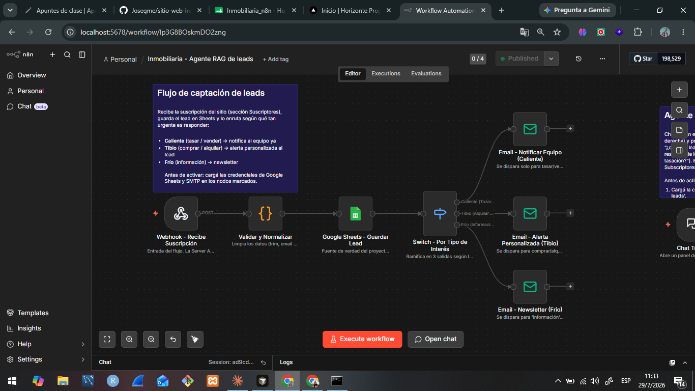

# Horizonte Propiedades — Sitio web inmobiliario con IA

     

Sitio web completo para una inmobiliaria ficticia de Buenos Aires (**Horizonte Propiedades**), desarrollado como Trabajo Final de la materia **Taller de Desarrollo**. Combina un frontend moderno en **Next.js 16** con persistencia y autenticación en **Supabase**, automatización de leads e **IA (agente RAG)** orquestada con **n8n**, y despliegue reproducible con **Docker Compose**.



**En un vistazo:**

- 🏠 **Sitio público:** Home, Quiénes Somos, Galería de propiedades con búsqueda, Cotizador inteligente, Suscriptores y Contacto.
- 🔐 **Portal de clientes:** login real con Supabase Auth (`/clientes`) y panel con las operaciones de cada cliente (RLS en Postgres).
- 🤖 **IA y automatización:** agente RAG sobre Google Sheets (n8n + Gemini), flujo automático de captación y clasificación de leads, y chatbot en el sitio.
- 🐳 **Docker:** build multi-stage y `docker-compose.yml` para levantar todo con un comando.

---

## Módulos de IA y automatización

### 🧠 Agente RAG de leads (requisito de IA)

Agente conversacional construido en **n8n** que responde preguntas del equipo con **datos reales recuperados de Google Sheets** (RAG: Retrieval-Augmented Generation). Usa **Google Gemini** como LLM y cuatro planillas como fuentes de conocimiento: *Subscriptores (leads)*, *Inventario-Inmuebles*, *Pagos-Inquilinos* y *Ventas-Inmuebles*.



Ejemplos de consultas: *"¿cuántos leads calientes tenemos?"*, *"dame un resumen de los leads de esta semana"*, *"¿quién pidió tasación?"*. El agente solo responde con datos recuperados de las planillas (no inventa información).

Se consume desde el panel `/admin` del sitio mediante el widget `@n8n/chat`, apuntando al **Chat Trigger** del workflow (variable `NEXT_PUBLIC_N8N_CHAT_URL`).

### ⚙️ Flujo de captación y clasificación de leads

El formulario de **Suscriptores** ejecuta una Server Action que valida con Zod, persiste el lead en Supabase (`public.leads`) y dispara un **webhook de n8n** que:

1. **Valida y normaliza** los datos (trim, email en minúsculas).
2. **Guarda el lead en Google Sheets** (fuente de verdad para el agente RAG).
3. **Clasifica por tipo de interés** con un nodo Switch y enruta la respuesta:
   - 🔥 **Caliente** (tasar / vender) → email inmediato al equipo.
   - 🌤️ **Tibio** (comprar / alquilar) → email de alerta personalizada al lead.
   - ❄️ **Frío** (información) → alta en newsletter.



Si n8n falla, el lead igual queda persistido en Supabase y el usuario recibe confirmación (el webhook se dispara después del insert).

### 💬 Chatbot del sitio y cotizador

- **Chatbot:** widget flotante con lógica conversacional que orienta al visitante y deriva a WhatsApp.
- **Cotizador inteligente:** formulario que estima el valor de una propiedad según tipo, zona, superficie y estado.

---

## Stack tecnológico

| Capa | Tecnología |
|---|---|
| Framework | Next.js 16 (App Router) + React 19 + TypeScript |
| Estilos | Tailwind CSS v4 + shadcn/ui |
| Formularios y validación | react-hook-form + Zod |
| Base de datos y auth | Supabase (Postgres + Auth + RLS) |
| Automatización e IA | n8n + Google Gemini + Google Sheets (`@n8n/chat` en el frontend) |
| Contenedores | Docker (build multi-stage) + Docker Compose |

---

## Cómo reproducir el proyecto

### Requisitos

- **Git**
- **Docker Desktop** (para la opción con Docker) o **Node.js 20+ y npm 10+** (para desarrollo local)
- Opcional para los módulos completos: proyecto de **Supabase** y una instancia de **n8n** con los workflows importados

### 1. Clonar y configurar variables de entorno

```bash
git clone https://github.com/Josegme/sitio-web-inmobiliaria.git
cd sitio-web-inmobiliaria
```

Copiar la plantilla de variables de entorno:

```bash
# Windows PowerShell
Copy-Item .env.local.example .env.local

# macOS / Linux
cp .env.local.example .env.local
```

Completar en `.env.local`:

| Variable | Descripción |
|---|---|
| `NEXT_PUBLIC_SITE_URL` | URL del sitio (`http://localhost:3000` en local) |
| `NEXT_PUBLIC_SUPABASE_URL` | Dashboard de Supabase → Project Settings → API Keys |
| `NEXT_PUBLIC_SUPABASE_PUBLISHABLE_KEY` | Dashboard de Supabase → Project Settings → API Keys |
| `NEXT_PUBLIC_N8N_CHAT_URL` | URL del Chat Trigger de n8n (ej. `http://localhost:5678/webhook/leads-rag-chat/chat`) |

### 2. Opción A — Levantar con Docker Compose (recomendada)

```bash
docker compose up --build
```

Abrir [http://localhost:3000](http://localhost:3000). Listo ✅

Qué hace el `docker-compose.yml`:

- **Builea la imagen** con un `Dockerfile` multi-stage (deps → build → runner liviano con `node:22-alpine`), pasando las variables `NEXT_PUBLIC_*` como *build args* porque Next.js las incrusta en el bundle durante `next build`.
- **Lee `.env.local`** como `env_file` para el runtime.
- **Expone el puerto 3000** y reinicia el contenedor salvo detención manual (`restart: unless-stopped`).
- **Mapea `host.docker.internal`** al gateway del host para que el contenedor llegue al n8n que corre fuera de Docker (Windows/Mac).

### 3. Opción B — Desarrollo local sin Docker

```bash
npm install
npm run dev
```

Abrir [http://localhost:3000](http://localhost:3000).

### 4. Configurar Supabase (portal de clientes y leads)

1. Crear un proyecto en [Supabase](https://supabase.com) y completar las variables del paso 1.
2. Ejecutar la migración `supabase/migrations/20260727130000_create_clients_auth.sql` en el **SQL Editor** (crea las tablas `profiles` y `client_operations`, las policies de RLS y el trigger de alta de perfiles).
3. Crear un usuario de prueba: Dashboard → **Authentication → Users → Add user** (email + contraseña para loguearse en `/clientes/login`). Opcional: metadata `{"full_name": "Nombre Apellido"}`.

### 5. Configurar n8n (automatización + agente RAG)

1. Levantar n8n (por ejemplo `npx n8n` o Docker) en `http://localhost:5678`.
2. Importar los dos workflows: **captación de leads** (Webhook → Validar → Google Sheets → Switch → Emails) y **Agente RAG de leads** (Chat Trigger → AI Agent con Gemini + tools de Google Sheets).
3. Cargar credenciales de **Google Sheets**, **SMTP** y **Gemini** en los nodos marcados.
4. **Activar** los workflows y usar las URLs de producción (`/webhook/...`, no `/webhook-test/...`).

---

## Estructura del proyecto

```
src/
├── app/          # Rutas (App Router): (marketing), /clientes, /admin
├── components/   # UI genérica (Navbar, Footer, shadcn/ui, etc.)
├── features/     # Módulos por dominio: properties, leads, quotation,
│                 # clients, chatbot, admin, team, contact, home
├── lib/          # Utilidades globales (constantes, formato, supabase)
└── hooks/        # Hooks reutilizables
```

La arquitectura completa (reglas de dependencia, anatomía de un feature, puntos de extensión) está documentada en **[ARCHITECTURE.md](./ARCHITECTURE.md)**.

## Trabajo en equipo

Proyecto grupal: cada integrante desarrolló su módulo de IA en una rama propia (`feature/<modulo>`) sobre el scaffold común, con módulos aislados en `src/features/` para minimizar conflictos de merge. El flujo Git del equipo está detallado en [ARCHITECTURE.md](./ARCHITECTURE.md) y en el historial de PRs del repositorio.

| Módulo | Rama |
|---|---|
| Automatización de leads + Agente RAG | `feature/leads-automation` |
| Chatbot con IA | `feature/chatbot` |
| Cotizador inteligente | `feature/quotation-ai` |
| Acceso de clientes (Supabase Auth) | `feature/clients-auth` |
| Búsqueda inteligente en galería | `feature/gallery-search` |

## Scripts disponibles

| Comando | Qué hace |
|---|---|
| `npm run dev` | Servidor de desarrollo con recarga automática |
| `npm run build` | Build de producción |
| `npm run start` | Corre la build de producción |
| `npm run lint` | ESLint sobre todo el proyecto |

---

## Licencia

Proyecto académico — Trabajo Final, Taller de Desarrollo.
